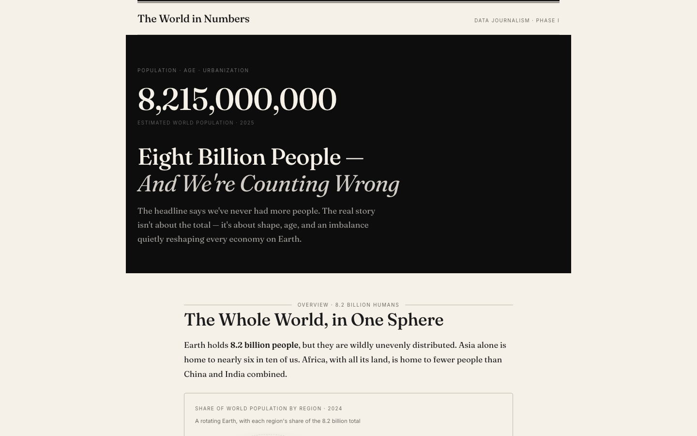

# Data Journalism Projects

This repository contains multiple data journalism projects.

## Projects

- [`projects/world-in-numbers/`](projects/world-in-numbers) — **The World in Numbers** (React + Vite + TypeScript): a long-form, scroll-driven story on world demographics with a Saudi Arabia focus. **[Live demo →](https://faisal-almugesib.github.io/data_journalism/)**



## Run a project

```bash
cd projects/world-in-numbers
npm install
npm run dev
```

