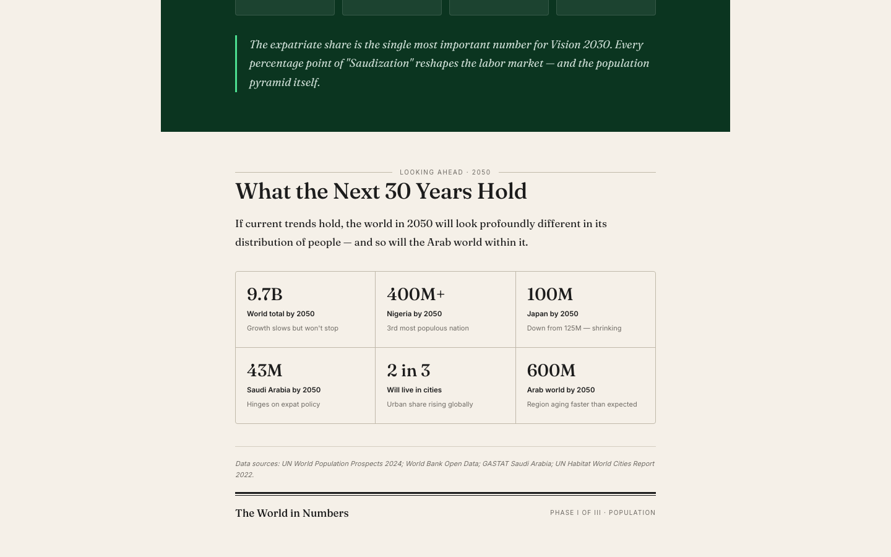
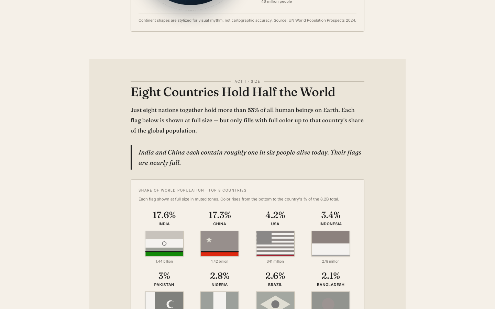

# The World in Numbers

A multi-phase data journalism project visualizing world demographics with a focus on the Arab world and Saudi Arabia. Newspaper-editorial design language with creative pictogram charts.

**🔗 Live demo: [faisal-almugesib.github.io/data_journalism](https://faisal-almugesib.github.io/data_journalism/)**

## Preview

| Hero | Closing — 2050 outlook |
|---|---|
|  |  |



## Data Sources

Figures are compiled from public datasets: UN World Population Prospects 2024, World Bank Open Data, GASTAT (Saudi Arabia), and the UN-Habitat World Cities Report 2022. Sources are also cited in the article footer.

## Stack

- **React 18 + Vite + TypeScript** — fast dev, type-safe
- **Tailwind CSS v4** — utility-first styling with custom design tokens
- **Framer Motion** — scroll reveals and counter animations
- **D3** — reserved for Phase 2/3 complex charts
- **React Router DOM** — multi-phase navigation
- **Inline SVG** — all flags, person figures, isometric buildings (no library)

## Setup

```bash
# Install dependencies
cd projects/world-in-numbers
npm install

# Run dev server (opens at http://localhost:5173)
npm run dev

# Production build
npm run build
npm run preview
```

## Project Structure

```
src/
├── main.tsx                    # Entry, router setup
├── pages/
│   └── Phase1.tsx              # Phase 1 composition
├── components/
│   ├── SvgDefs.tsx             # All flag + person SVG symbols
│   ├── Common.tsx              # SectionRule, CBox, Kpi, Caption
│   └── phase1/
│       ├── Hero.tsx            # Masthead + animated counter
│       ├── Globe.tsx           # 3D rotating globe pie
│       ├── FlagFill.tsx        # Desaturated flags + clip-path fill
│       ├── Age.tsx             # Life stages + interactive pyramid
│       ├── Riyadh.tsx          # Isometric 3D skyline
│       ├── KsaSpotlight.tsx    # 100-figure grid + stat cards
│       └── Closing.tsx         # 2050 projections grid
├── data/
│   ├── countries.ts            # Top 8 countries, regions
│   ├── age.ts                  # Life stages, pyramid data
│   └── cities.ts               # Urban shares, KSA stats, 2050 projections
├── hooks/
│   └── useCounter.ts           # Animated number counter
└── styles/
    └── globals.css             # Tailwind + design tokens
```

## Design Tokens

Defined in `src/styles/globals.css` as CSS custom properties:

- **Paper tones**: `--color-paper` (#f5f0e8), `--color-paper-2` (#ebe5d9)
- **Ink tones**: `--color-ink` (#1c1c1c), `--color-ink-2` (#3a3a3a), `--color-muted` (#6e6a64)
- **KSA palette**: `--color-ksa` (#1a5e36 dark green), `--color-ksa-light` (#4cdf90), `--color-gold` (#d4a73c)
- **Typography**: Fraunces (serif headlines/body), Inter (sans labels/data)

---

## Questions This Article Answers

The article is structured as a three-act narrative with one driving thesis: **the headline number — eight billion — hides a more important story about distribution, age, and urbanization.**

### Overview — How are 8.2 billion people distributed?
- What share of humanity lives in each region?
- Why does Asia hold 59% of all people while sitting on a smaller landmass than Africa?

### Act I — Size: Where do people actually live?
- Which 8 countries together hold more than half the world?
- How dramatic is the gap between the top two (India + China = 1 in 3 humans) and everyone else?
- What is each country's share of the global 8.2B total?

### Act II — Age: How old is the typical person, and where?
- Which countries are youngest? Oldest?
- How do you group countries by life stage rather than continent?
- Where does Saudi Arabia sit relative to its Arab neighbors and to Europe?
- What does an aging society (Japan), a growing society (Nigeria), and a labor-migration society (Saudi Arabia) actually look like in pyramid form?
- Why does KSA have a male bulge in the working-age range?

### Act III — Cities: Where will people live?
- How fast did Riyadh transform from a town of 150K to a megacity of 7M?
- How does Saudi Arabia's urban share compare to the world and the Arab world?
- What does compressed urbanization look like, decade by decade?

### KSA Spotlight — Who lives in Saudi Arabia?
- If you took 100 representative residents, how many would be Saudi nationals vs. expatriates?
- What is the size, age, and urban density of the country?
- Why is the expatriate share the most consequential number for Vision 2030?

### Closing — What happens next?
- What will the world look like in 2050?
- Who will gain people (Nigeria → 400M+)? Who will shrink (Japan → 100M)?
- How will the Arab world's demographics change?
- Will most humans live in cities by then?

---

## Design Decisions

- **Newspaper editorial aesthetic** rather than dashboard-style. Serif headlines, paper-tone backgrounds, structured sections.
- **Pictogram-first charts** instead of standard bar/line charts: stick figures for pyramids, flags as fill containers, isometric buildings for cities.
- **KSA threaded through every section** rather than confined to one panel — it appears in the flag chart's omission (it's not in the top 8), the life-stage pictogram (highlighted in "Maturing"), the pyramid tabs, and the skyline.
- **Single-screen continuous scroll** rather than slide-by-slide, reinforcing the "long-form journalism" framing.

## Phase 2 (Work Market 2010–now) and Phase 3 (Unemployment Simulation) — Coming Next

Routes are reserved at `/phase-2` and `/phase-3`. Each will live in `src/pages/` with its own component subdirectory under `src/components/`.
